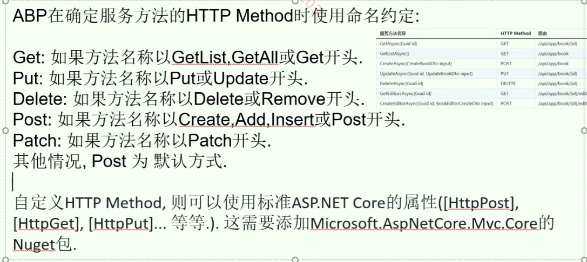
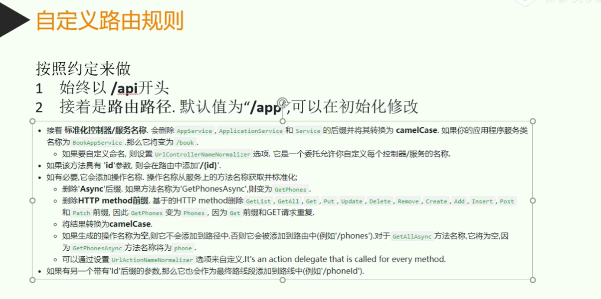
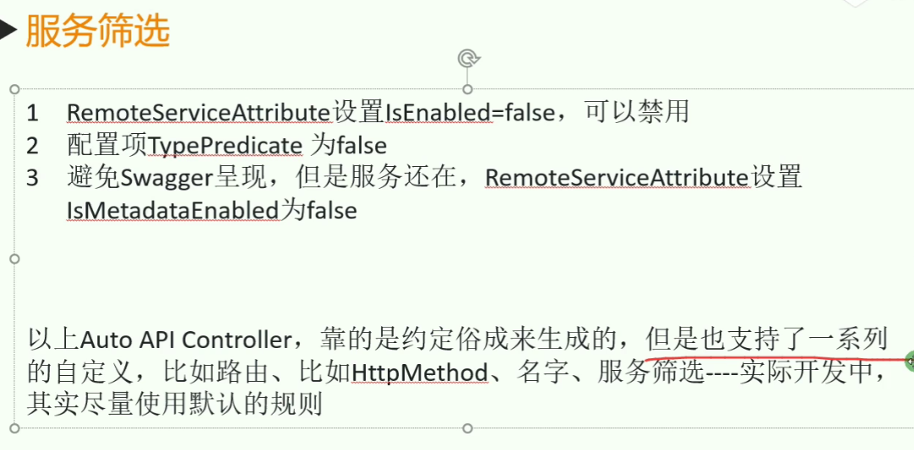

# ABP vNext配置

## 1. 模块化配置（AbpModule）

1. 可支持API、UI 扩展
2. 可随意[整合](#模块整合)和[拆分](#模块拆分)
3. 定制化需求 —— options

---

### 模块整合

下面是三种配置依赖模块的方式，分别是引用式、插件式、nuget

#### 1. 引用式模块

需引用dll

配置步骤：

1. 模块依赖 —— DependsOn(typeof(___Module)) 需避免循环依赖
2. 配置DI —— ConfigureServices, 只需要标记，之后Abp框架会自动注入 [详见3. IOC三种注册](#3-ioc三种注册)
3. 初始化 —— 主模块的Configure中调用app.OnApplicationIntialization() —— 管道 中间件

#### 2. 插件式模块

无需显示引用dll

配置步骤：

1. 需依赖的模块编译生成dll
2. 拷贝dll到对应目录如 /plugins/*.dll
3. 在ConfigureServices中配置如下

```CSharp
context.Services.AddApplication<BookStoreApplicationModule>(
    options =>
    {
        options.PlugInSources.AddFolder(@"\plugins");
    }
);
```

#### 3. nuget模块

TODO 需搭建nuget私服

---

### 模块拆分

TODO 动态C#客户端 —— 调用分布式服务如同调用本地类

---

### 配置swagger

```CSharp
public override void ConfigureServices(ServiceConfigurationContext context)
{
    context.services.AddAbpSwaggerGen(options =>
    {
        options.SwaggerDoc("v1", new OpenApiInfo { Title = "BookStore API", Version = "v1" });
        options.DocInclusionPredicate((docName, description) => true);
        options.CustomSchemaIds(type => type.FullName);
    });
}

// 或者是在Configure
public override void OnApplicationInitialization(ApplicationInitializationContext context)
{
    var app = context.GetApplicationBuilder();
    var env = context.GetEnvironment();

    //配置swagger中间件
    app.UseSwagger();
    app.UseAbpSwaggerUI(options =>
    {
        options.SwaggerEndpoint("/swagger/v1/swagger.json", "BookStore API");
    });
   
}

```

---

### 程序启动的执行顺序

1. ConfigureServices() —— 从**内**到**外**
2. Configure() —— 从**内**到**外**
3. ShutDown() —— 从**外**到**内**

## 2. AutoAPI

AutoAPI是指——不用写controller，框架直接用application层

配置步骤：

1. Configure中配置swagger
2. ConfigureServices配置options —— ConventionalControllers.Create(typeof(ApplicationModule).Assembly)

``` CSharp
public override void ConfigureServices(ServiceConfigurationContext context)
{
    Configure<AbpAspNetCoreMvcOptions>(options =>
    {
        options.ConventionalControllers.Create(typeof(BookStoreApplicationModule).Assembly);
    });
}
```

3. ApplicationService加上接口 **IRemoteService**

AutoAPI如何制定请求类型：

约定俗成的规则：


自定义规则：



## 3. IOC三种注册

1. 手动注册 —— CongigureServices中调用Add___()
2. 接口自动注册 —— I___Dependency
3. 特性自动注册 —— [Dependecncy(ServiceLifetime.___)]

done.
